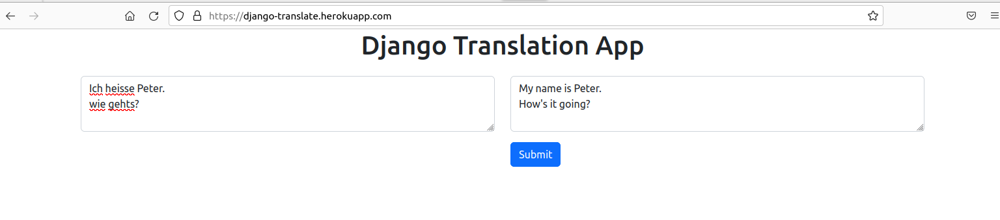
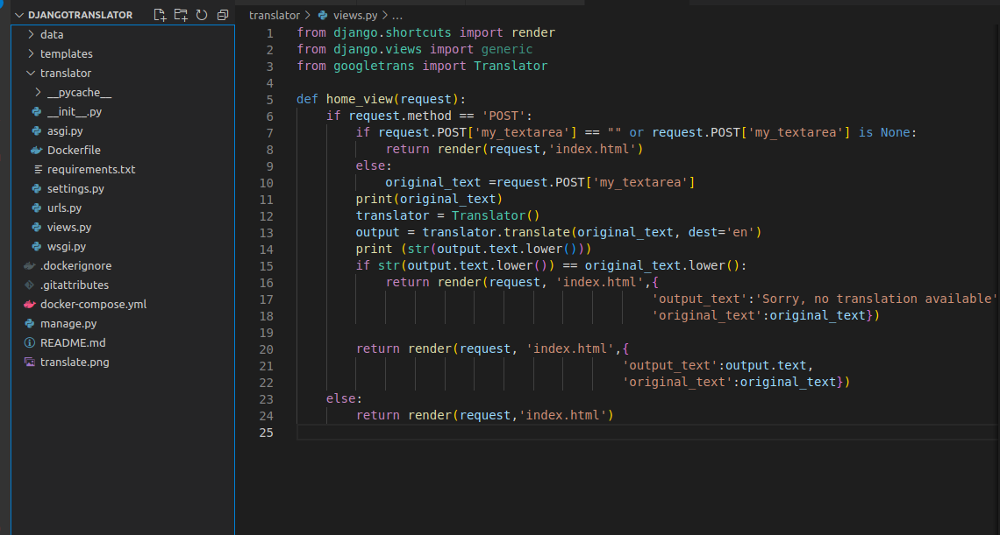

<h2>Django Translator Project</h2>

<h4>Project website</h4>
https://django-translate.herokuapp.com/

<p float="left">
    <p>This project creates a django website that can translate from any language to english<br>
    I have developed it in docker and then deployed it to heroku to show how it works<br>
    I have added the autofocus for the field on page load and script to enable 'enter' <br>
    to submit the form.
    </p>
</p>


 	 

	


`code`
```python
#requirements.txt
Django==4.0.5
SQLAlchemy==1.4.37
asgiref==3.5.2
psycopg2-binary==2.9.3
sqlparse==0.4.2
googletrans-py==4.0.0
```

